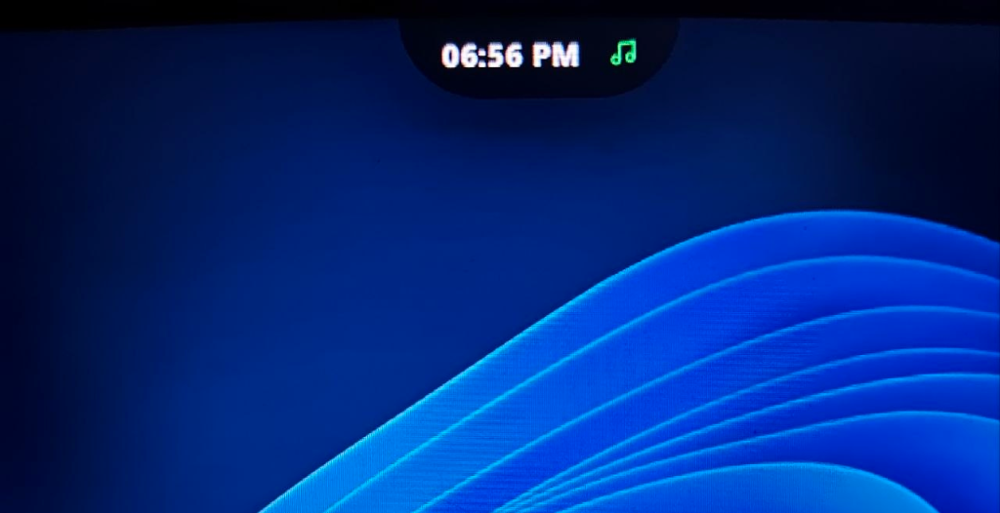
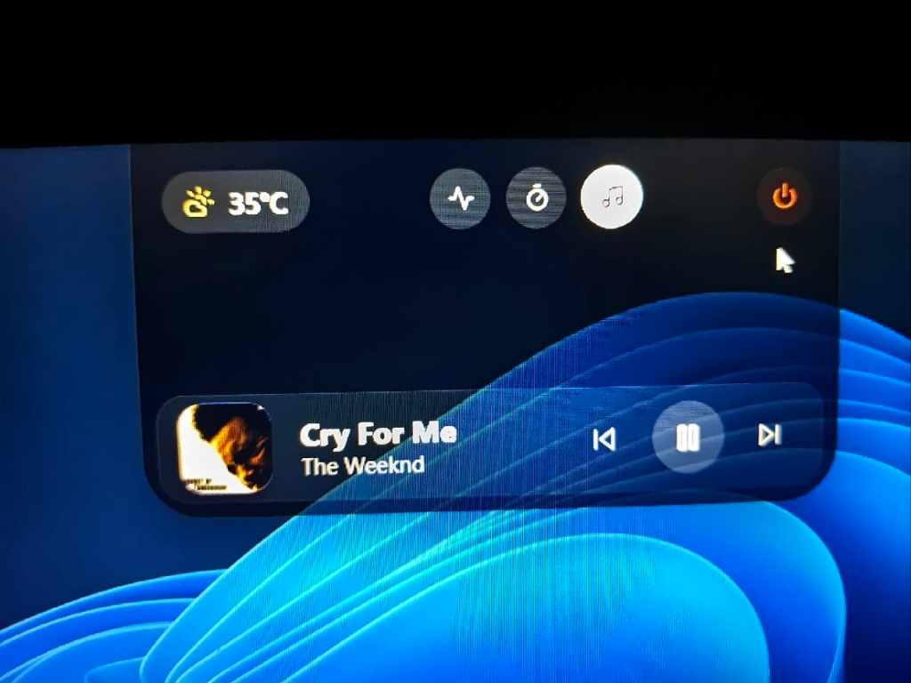
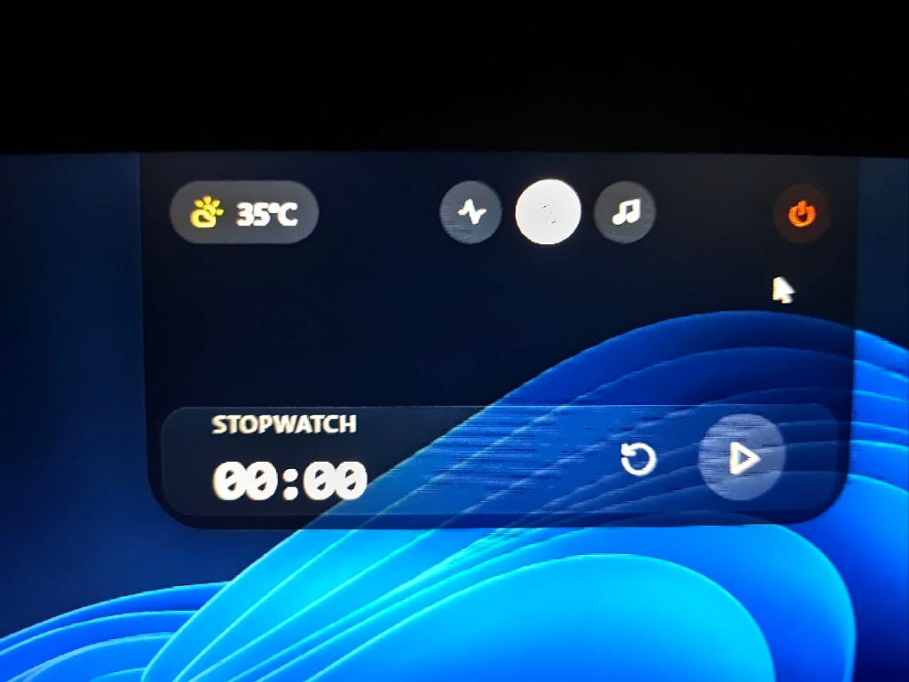
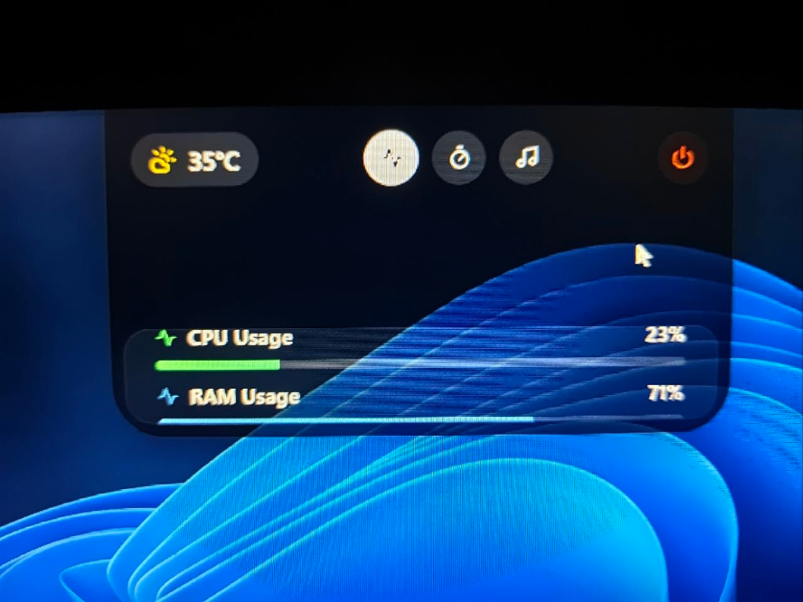

# Dynamic Island for Windows

A sleek, Dynamic Island style application for Windows desktops built with Electron and React.

## Screenshots
| Compact Mode | Media Player Mode |
|:---:|:---:|
|  |  |

| Stopwatch Mode | Hardware Stats Mode |
|:---:|:---:|
|  |  |

## Features
- Dynamic Island-style UI notch mechanism
- Smooth animations using Framer Motion
- Media controls with Spotify Web API integration
- Auto-starts on login
- Interactive, responsive, and beautiful UI

## Installation

You can download the compiled installer for Windows from the [Installers](./Installers/App_Installer.zip) folder.

1. Download the `App_Installer.zip` file.
2. Extract the archive.
3. Run `Dynamic Island Setup 1.0.0.exe` to install.

## Development

If you'd like to build the project locally or contribute:

1. Clone the repository:
   ```bash
   git clone https://github.com/Avenger11764/Dynamic_island.git
   ```
2. Install dependencies:
   ```bash
   npm install
   ```
3. Run development server:
   ```bash
   npm run dev
   ```
4. Build for production:
   ```bash
   npm run dist
   ```

## License
MIT
