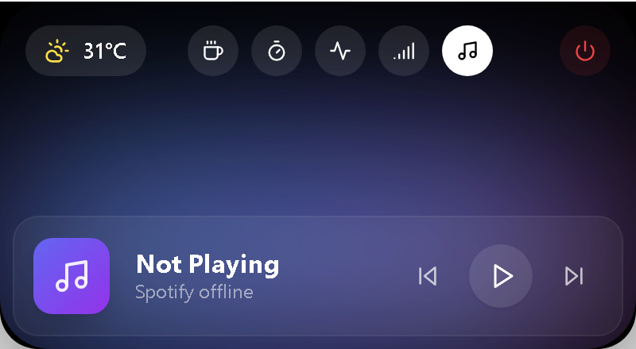
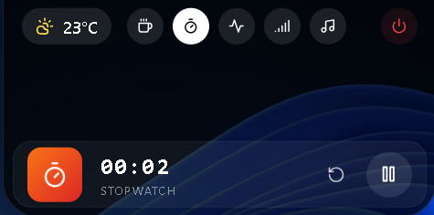
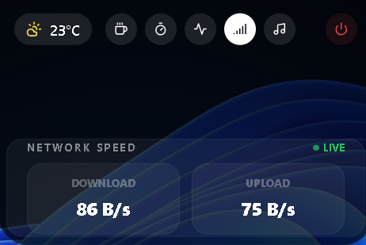

# Dynamic Island for Windows

A sleek, Dynamic Island style application for Windows desktops built with Electron and React.

## Screenshots
| Compact Mode | Media Player Mode |
|:---:|:---:|
|  |  |

| Stopwatch Mode | Hardware Stats Mode |
|:---:|:---:|
|  |  |

| Network Speed Mode | Pomodoro Timer Mode |
|:---:|:---:|
|  |  |

## Features
- **Dynamic Island-style UI** notch mechanism with butter-smooth GPU-accelerated animations using Framer Motion.
- **Media Controls** with Spotify integration, complete with a dynamic ambient glow that color-matches the playing album art.
- **Pomodoro Timer** featuring adjustable Work and Break intervals, accompanied by native Windows Notifications upon completion.
- **Hardware & Network Monitoring** showcasing CPU, RAM, and Live Network speeds (with smart polling for maximum performance).
- **System Controls** allowing global Volume and Brightness adjustments via simple mouse-wheel scroll gestures over the island.
- **Right-Click Context Menu** for swift application controls.
- **Secure Architecture** fully isolated contexts via preload scripts ensuring optimal performance and safety.
- Auto-starts on login persistently.

## Installation

You can download the compiled installer for Windows from the [Installers](./Installers/App_Installer.zip) folder.

1. Download the `App_Installer.zip` file.
2. Extract the archive.
3. Run `Dynamic Island Setup 1.0.0.exe` to install.

## Development

If you'd like to build the project locally or contribute:

1. Clone the repository:
   ```bash
   git clone https://github.com/Avenger11764/Dynamic_island.git
   ```
2. Install dependencies:
   ```bash
   npm install
   ```
3. Run development server:
   ```bash
   npm run dev
   ```
4. Build for production:
   ```bash
   npm run dist
   ```

## License
MIT
