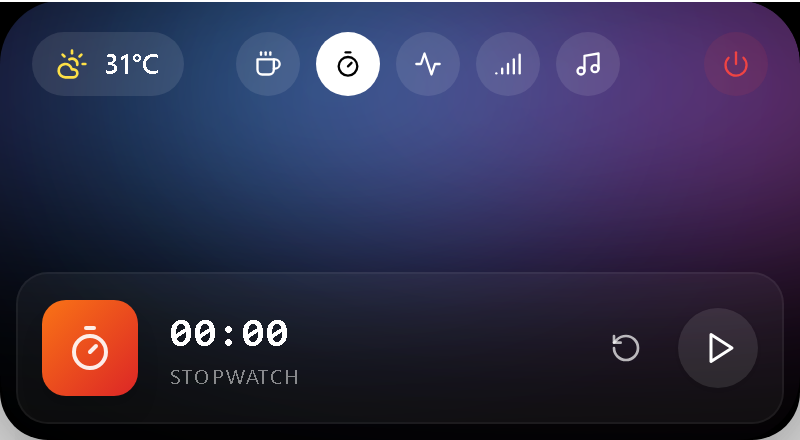
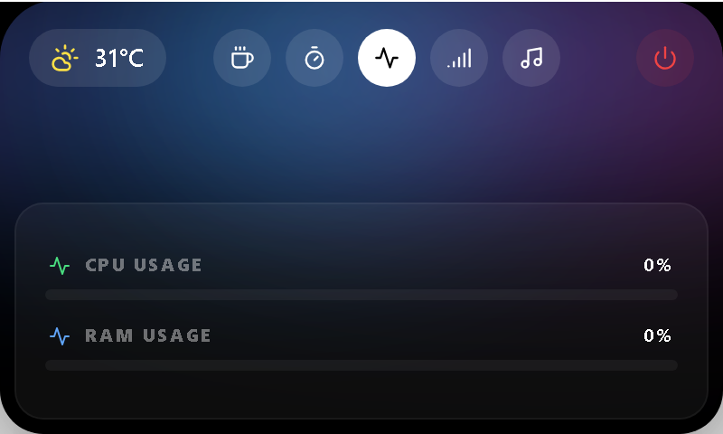
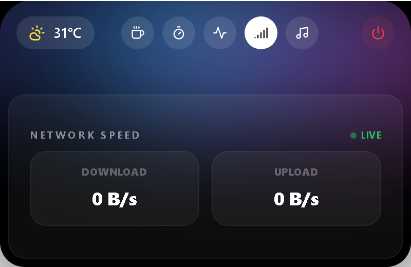
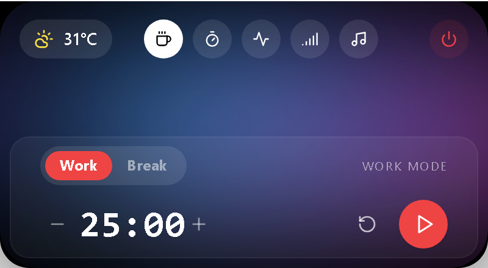

# Smart Notch for Windows

**🌐 Official Website / Download:** [dynamic-island-windows.vercel.app](https://dynamic-island-windows.vercel.app/)

A sleek, Smart Notch style application for Windows desktops built with Electron and React.

## Screenshots
| Compact Mode | Media Player Mode |
|:---:|:---:|
|  |  |

| Stopwatch Mode | Hardware Stats Mode |
|:---:|:---:|
|  |  |

| Network Speed Mode | Pomodoro Timer Mode |
|:---:|:---:|
|  |  |

## Features
- **Media Controls**: Native Spotify integration with a dynamic audio waveform and liquid ambient glow that pulses with the beat.
- **Intelligent Indicators**: A compact notch state featuring live battery rings, network blips, CPU spikes, and hardware metrics at a glance.
- **Active Timers**: Live Pomodoro and Stopwatch counters that seamlessly replace the clock in the collapsed state when running.
- **Hardware & Network**: Live CPU, RAM, and internet speeds tracked in real-time via beautifully designed expanded UI panels.
- **System Controls**: Change global Volume and Brightness seamlessly using quick mouse-wheel scroll gestures over the island.
- **Flawless Layering**: Custom engine strictly enforcing highest z-index, keeping the notch flawlessly above all full-screen apps and games.
- **Smart Greetings**: A personalized, time-aware greeting that smoothly expands to welcome you upon waking or starting your machine.
- **Liquid Physics**: A premium, snappy spring-physics animation system mimicking native hardware filleting and seamless expansions.
- **Secure & Efficient**: Built safely with fully isolated Electron contexts, utilizing smart background polling to ensure near-zero resource drain.

## Installation

You can download the compiled installer for Windows from the [Installers](./Installers/App_Installer.zip) folder.

1. Download the `App_Installer.zip` file.
2. Extract the archive.
3. Run `Smart Notch Setup 1.0.1.exe` to install.

## Development

If you'd like to build the project locally or contribute:

1. Clone the repository:
   ```bash
   git clone https://github.com/Avenger11764/Dynamic_island.git
   ```
2. Install dependencies:
   ```bash
   npm install
   ```
3. Run development server:
   ```bash
   npm run dev
   ```
4. Build for production:
   ```bash
   npm run dist
   ```

## License
MIT
