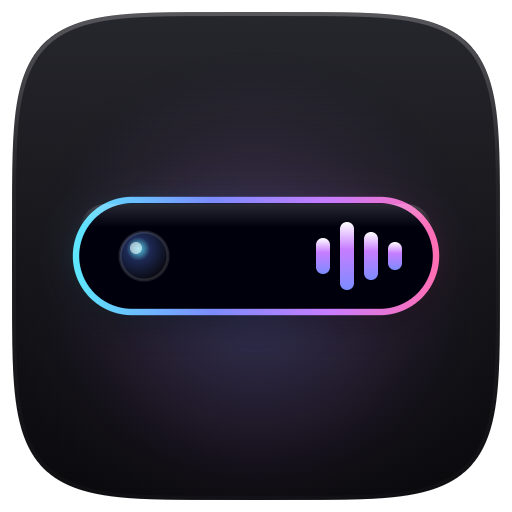
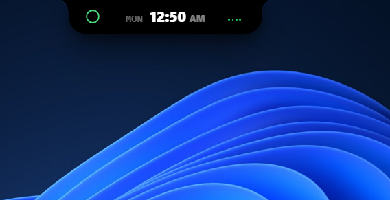
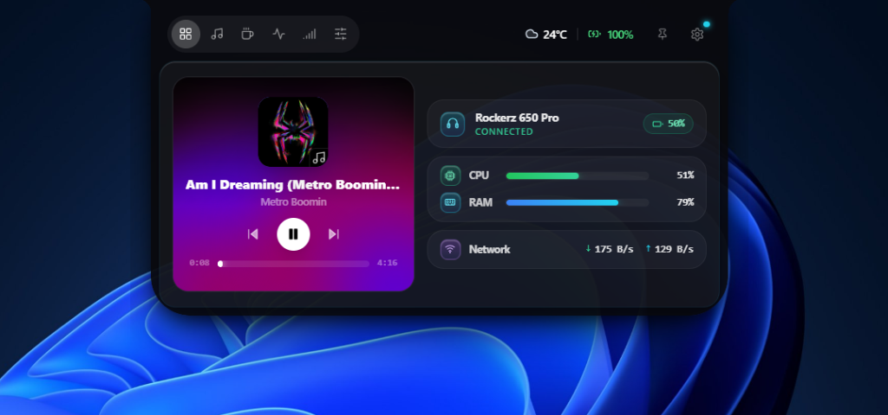
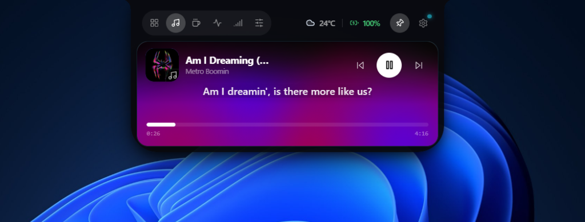
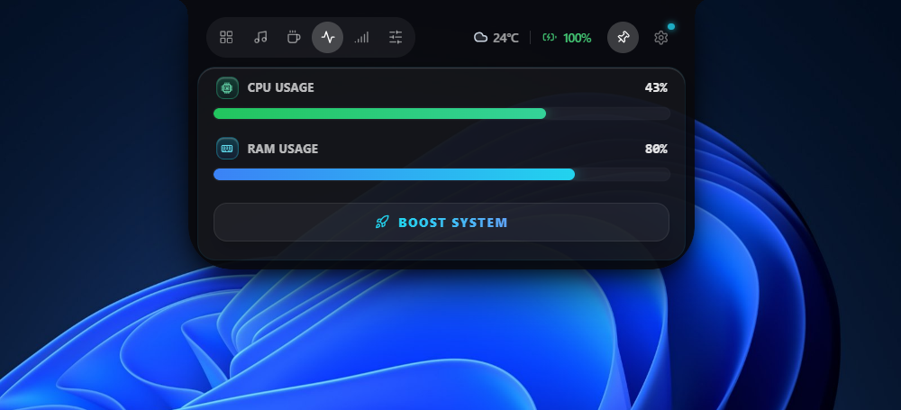
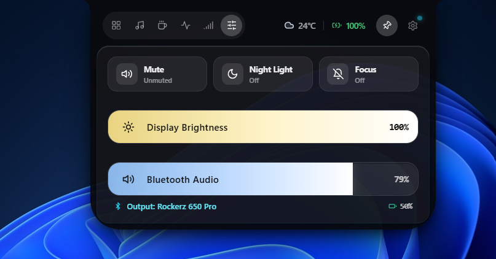
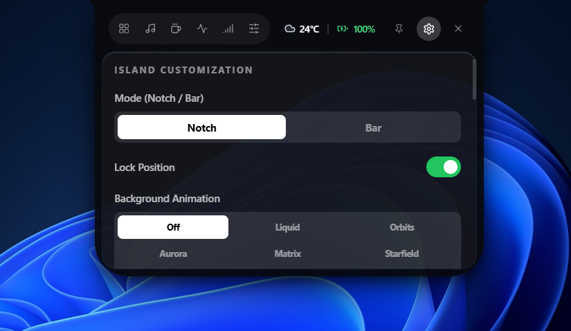
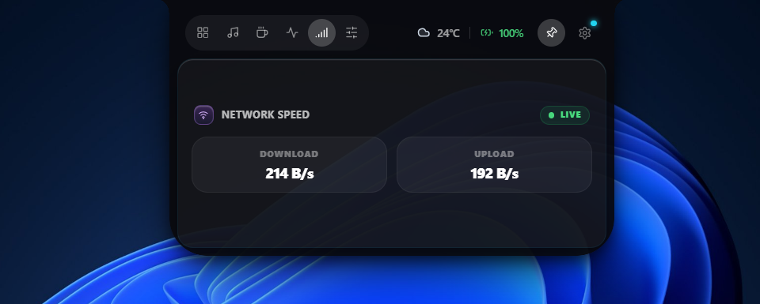

# Smart Notch for Windows (v7.0.6)

<p align="center">
  
</p>

<h3 align="center">The Dynamic Island experience, reimagined for Windows.</h3>

<p align="center">
  <a href="https://apps.microsoft.com/detail/9N1D46F5X565?mode=direct">
    
  </a>
  &nbsp;&nbsp;
  <a href="https://smart-notch-windows.vercel.app/">
    
  </a>
  &nbsp;&nbsp;
  <a href="https://github.com/Avenger11764/Dynamic_island/raw/main/website/public/Smart_Notch_Setup_7.0.6.exe">
    
  </a>
</p>

---

## 🌟 What's New in Version 7.0.6

- **🎧 Bluetooth Quick Connect**: Connect or disconnect your paired headphones and speakers right from the notch or the bar, with battery level at a glance. A new Bluetooth tab in the notch, a popover in the top bar and a card in the side bar.
- **🚀 Much Lighter on Your PC**: Smart Notch now uses roughly a third of the processor time it did. On the development laptop, idle use fell from about 3% to about 1%, music playing from about 10% to under 3%, and the heaviest background effect from over 20% to about 6%.
- **🔇 Quieter in the Background**: Media, brightness and Bluetooth are followed through Windows events instead of constant checking.
- **🌙 Calmer When Paused**: The album glow and the Ambient effect now rest when your music is paused.
- **⚡ Faster Media Response**: Play, pause and track changes show up in the notch sooner.

<details>
<summary><b>Version 7.0.5</b></summary>

- **A fresh new look**: A calmer, cleaner design for the notch, alerts, bar and settings, with a new battery ring and logo.
- **Lights that move to your music**: The music bars, album glow and effects pulse to the beat of whatever is playing.
- **New background effects**: Visualizer, Waves and Synthwave in your album's colours, plus Fireflies, Holographic and Topographic.
- **More reliable popups**: Bluetooth, volume and brightness popups keep working after connecting headphones or waking from sleep.
- **Better bar mode**: Focus timer, calendar and quick toggles in the side bar, and a startable timer in the top bar.
- **Smoother dragging**: See where the notch will land while dragging.
- **Update notices**: A heads-up when a new version is in the Microsoft Store, and what's new after updating.

</details>

---

## 📸 Screenshots

| Collapsed Notch (Idle) | Dashboard View |
|:---:|:---:|
|  |  |

| Live Synced Lyrics & Media | Hardware Telemetry & Boost |
|:---:|:---:|
|  |  |

| Control Center | Settings & Customization |
|:---:|:---:|
|  |  |

| Network Speed Monitor | Edge Shelf / Docking Bar |
|:---:|:---:|
|  |  |

---

## ✨ Features

- **Media Controls & Synced Lyrics**: Works with Spotify, browsers and any app that reports to Windows media controls. Synced lyrics, album-coloured glow and music bars that move to the beat.
- **Bluetooth Quick Connect**: See your paired headphones and speakers, tap to connect or disconnect, and get a popup with battery level when one connects.
- **Intelligent Status Capsule**: Compact idle state with a battery ring, time and date, and dots that show when the camera or microphone is in use.
- **System Stats**: Live CPU, RAM and network speeds, shown only while you're looking at them.
- **One-Tap Memory Optimize**: Returns idle memory from background apps to Windows without closing anything.
- **Control Center**: Volume and brightness sliders, mute, Night light and Do not disturb. Scroll over the notch to adjust volume or brightness, and get a clean popup when you use your keyboard keys.
- **Focus & Productivity**: Built-in focus timer with a task list, and a stopwatch that takes over the collapsed pill while running.
- **Notch or Bar**: Use it as a notch, a full-width top bar or a side bar, docked to the top, left or right edge. Drag it to move it.
- **Customization**: Accent colours including RGB, panel materials, card styles, glow intensity, custom background images and nine background effects.
- **Always on Top**: Stays above full-screen apps and games without taking keyboard focus.
- **Private by Design**: No telemetry and no account. The only network requests are for the weather, song lyrics and update checks.

---

## 📥 Installation

### Method 1: Microsoft Store (Recommended)
Install from the [Microsoft Store](https://apps.microsoft.com/detail/9N1D46F5X565?mode=direct) for automatic updates.

### Method 2: Direct Setup Installer
Download the Windows installer:
- **Installer**: [Smart Notch Setup 7.0.6.exe](https://github.com/Avenger11764/Dynamic_island/raw/main/website/public/Smart_Notch_Setup_7.0.6.exe)
- Also available from the [official website](https://smart-notch-windows.vercel.app/)

Requires Windows 10 (version 1809) or Windows 11, 64-bit.

---

## 🛠️ Local Development

If you'd like to build or run Smart Notch locally:

1. **Clone the repository:**
   ```bash
   git clone https://github.com/Avenger11764/Dynamic_island.git
   cd Dynamic_island
   ```

2. **Install dependencies:**
   ```bash
   npm install
   ```

3. **Start the UI in development mode:**
   ```bash
   npm run dev
   ```

4. **Launch the Electron app** (in a second terminal; it loads the built UI if `build_dist/` exists, otherwise the dev server):
   ```bash
   npm run electron:start
   ```

5. **Build production packages** (output goes to `release/`):
   ```bash
   # Build NSIS Setup Installer
   npm run dist

   # Build Microsoft Store Package (.appx)
   npm run store
   ```

### Project layout

| Path | What it is |
|---|---|
| `main.js` | Electron main process: windows, IPC, background monitor |
| `system_control.ps1` | Worker for volume, brightness, Bluetooth and quick toggles |
| `smtc-worker.js` | Worker that follows Windows media sessions |
| `updater.js` | Update checks |
| `src/` | React UI (notch, bar and settings window) |
| `website/` | The official website |

---

## 📄 License

This project is open source and available under the [MIT License](LICENSE).
